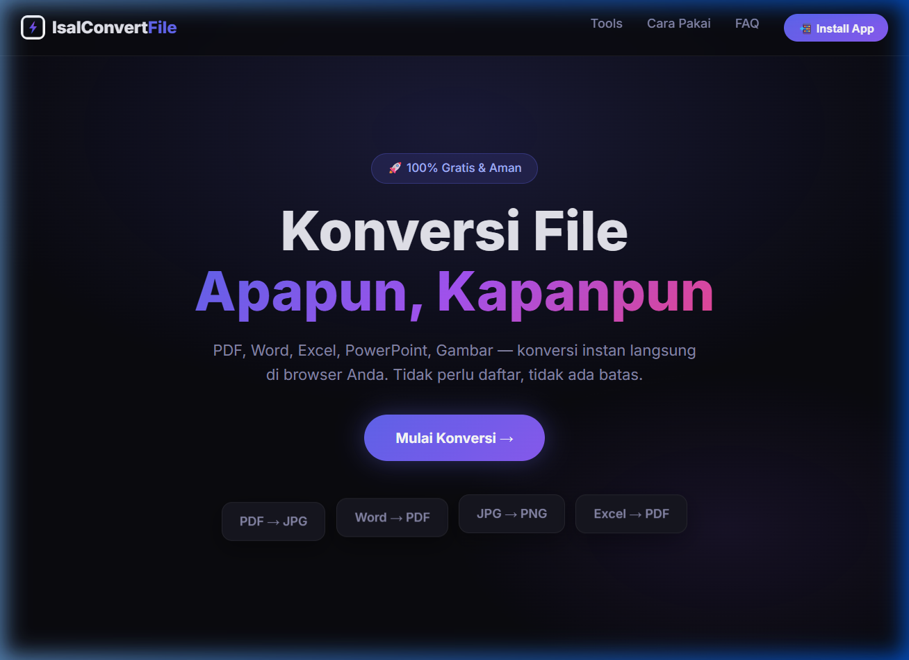

<div align="center">
  
  <h1>⚡ IsalConvertFile</h1>
  <p>Aplikasi Konversi Berbagai Format File Secara Mudah, Cepat, dan Offline (PWA).</p>
</div>



---


## ✨ Fitur Utama

- **Konversi Lengkap (10+ Tools):**
  - PDF ↔ Gambar (JPG/PNG)
  - Word (DOC/DOCX) ↔ PDF & Gambar
  - Excel (XLS/XLSX) ↔ PDF
  - PowerPoint (PPT/PPTX) ↔ PDF
  - Gambar ↔ Gambar (Ubah format)
  - Kompresi Gambar
  - Teks (TXT) ↔ PDF
- **Progressive Web App (PWA):** Dapat di-install langsung dari browser layaknya aplikasi desktop native.
- **Offline Mode:** Karena berjalan di atas *localhost*, semua file diproses langsung di komputer Anda tanpa koneksi internet (Privasi 100% terjaga).
- **Auto-Cleanup:** File hasil konversi dan unggahan sementara akan dihapus secara otomatis dari server setelah 5 menit untuk menghemat penyimpanan.
- **UI Modern:** Menggunakan desain *Dark Mode* bergaya *Glassmorphism* yang elegan dan sangat responsif di PC maupun Smartphone.

## 🛠 Teknologi

- **Backend:** Python (Flask)
- **Pemrosesan File:** `PyMuPDF` (PDF), `Pillow` (Gambar), `docx2pdf` (Word), `pywin32` (Office automation), `reportlab` (PDF generation).
- **Frontend:** HTML5, CSS3, Vanilla JS, Service Workers (PWA).

## 🚀 Cara Instalasi & Menjalankan

### Persyaratan Sistem
- Python 3.8 atau lebih baru.
- Microsoft Office (Word, Excel, PowerPoint) terinstal di sistem Windows Anda.
- Windows 10/11 direkomendasikan untuk dukungan penuh.

### Langkah 1: Siapkan Virtual Environment (Direkomendasikan)
1. Buka PowerShell, lalu masuk ke folder proyek:
   ```powershell
   cd F:\project\convert
   ```
2. Buat virtual environment baru:
   ```powershell
   python -m venv .venv
   ```
3. Aktifkan virtual environment:
   ```powershell
   .\.venv\Scripts\Activate.ps1
   ```

> Jika perintah `python` tidak tersedia, ganti dengan path Python yang valid atau `py`.

### Langkah 2: Install Dependensi Python
Setelah virtual environment aktif, jalankan:

```powershell
python -m pip install --upgrade pip
python -m pip install -r requirements.txt
```

> Jika menggunakan lingkungan Python yang dikelola (`uv`), pastikan Anda sudah membuat dan mengaktifkan virtual environment seperti di atas.

### Langkah 3: Jalankan Aplikasi
Dengan virtual environment aktif, jalankan:

```powershell
python app.py
```

Atau jalankan `start.bat` dari folder proyek:

```powershell
.\start.bat
```

### Langkah 4: Akses Aplikasi
Buka browser dan kunjungi:

```
http://127.0.0.1:5000
```

Jika muncul halaman aplikasi, berarti server berjalan.

### Langkah 5: Install PWA (Opsional)
Jika browser menampilkan notifikasi PWA, klik **"Install App"** atau ikon install untuk memasang aplikasi sebagai native app.

### Cara Penggunaan
1. Pilih jenis konversi yang diinginkan (misalnya PDF ke JPG, Word ke PDF, atau kompresi gambar).
2. Unggah file sumber dari komputer Anda.
3. Klik tombol proses/convert.
4. Tunggu sampai hasil selesai diproses.
5. Unduh file hasil konversi ke komputer Anda.

### Troubleshooting
- Jika perintah `python` tidak dikenali:
  - Pastikan Python sudah terinstall dan PATH sudah benar.
  - Gunakan `py -3` jika `python` tidak tersedia.
- Jika muncul error `externally-managed-environment` saat install pip:
  - Gunakan virtual environment seperti langkah di atas.
- Jika `Activate.ps1` tidak bisa dijalankan karena kebijakan PowerShell:
  ```powershell
  Set-ExecutionPolicy -Scope Process -ExecutionPolicy Bypass
  .\.venv\Scripts\Activate.ps1
  ```
- Jika aplikasi tidak muncul di browser, pastikan proses `python app.py` berjalan dan tidak ada error di terminal.

---
*Dibuat dengan ❤️ oleh [Faisal Abdul Majid](mailto:faisalabdulmajid.dev@gmail.com).*
